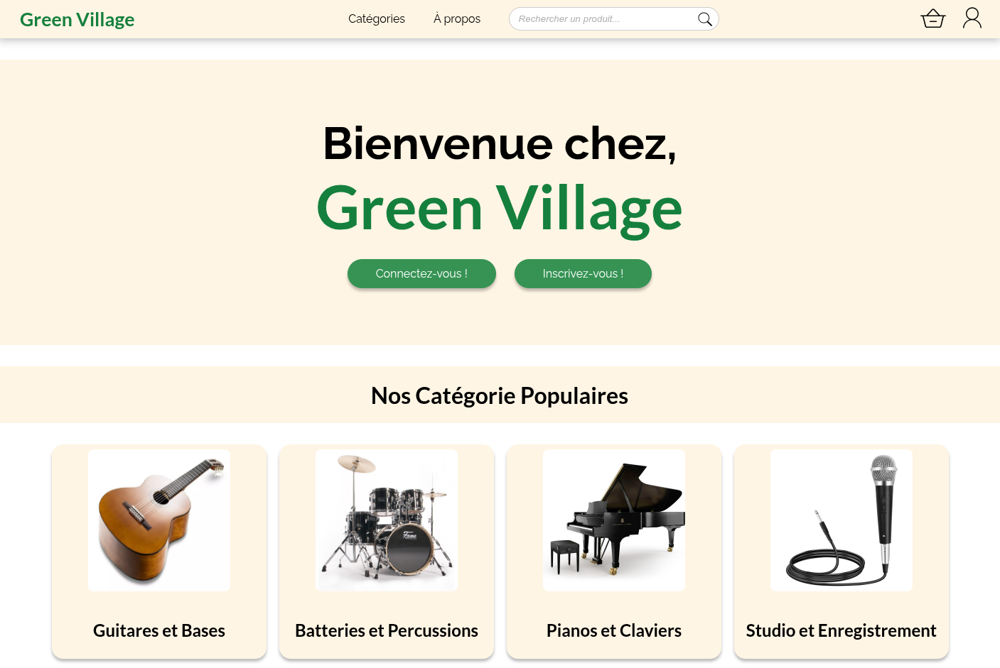

# Fil Rouge CDA - Projet E-commerce Green Village

Green Village est un projet fictif développé dans le cadre de ma formation CDA (Certification Développeur Web) avec Symfony et React, conçu pour gérer une boutique en ligne d’instruments de musique. L’interface responsive utilise Tailwind CSS, combinant des pages Symfony et des composants interactifs React.

Le projet propose une gestion sécurisée des utilisateurs avec rôles (client, commercial, admin), offrant un accès à des pages d’administration pour gérer produits, fournisseurs, commandes et livraisons.

Une API REST avec Api Platform expose les entités principales et fournit une documentation interactive via Swagger, facilitant l’intégration avec les composants React et d’autres systèmes.

Les utilisateurs peuvent gérer leur profil, consulter l’historique des commandes et suivre l’état des livraisons.

La sécurité est renforcée par la gestion des permissions, l’authentification JWT et la protection CSRF sur les formulaires.

## Conception et mise en place d'une base de données relationnelle

### Base de données :

- [x] Élaboration du dictionnaire de données
- [x] Répertorisation des règles de gestion avec identifiants
- [x] Construction du schéma entité-association (validation formateur requise)
- [x] Création du script de génération de la base de données

### Structure et contraintes :

- [x] Création de la base de données (contraintes, index, droits)
- [x] Script d'insertion des données de test (données cohérentes)
- [x] Mise en place des procédures de sauvegarde-restauration
- [x] Test de restauration

## Développement des composants d'accès aux données SQL et NoSQL

### Requêtes et procédures :

- [x] Scripts SQL pour les interrogations du tableau de bord
- [x] Procédure stockée : sélection des commandes non soldées
- [x] Procédure stockée : calcul du délai moyen commande/facturation

### Gestion des vues :

- [x] Vue jointure Produits - Fournisseurs
- [x] Vue jointure Produits - Catégorie/Sous-catégorie

## Analyse des besoins et maquettage d'une application

### Maquettes Web (Mockflow/Figma) :

- [x] Fenêtre de démarrage (liste des catégories)
- [x] Page liste des sous-catégories
- [x] Page liste des produits d'une sous-catégorie
- [x] Page détails produit + ajout panier
- [x] Page contenu du panier
- [x] Page d'inscription
- [x] Page de connexion
- [x] Page changement de mot de passe

### Maquettes Mobile :

- [x] Écran de démarrage (liste des catégories)
- [x] Page sous-catégories d'une catégorie
- [x] Page produits d'une sous-catégorie
- [x] Page détails du produit sélectionné

## Architecture logicielle d'une application

### Diagrammes UML :

- [x] Diagramme des cas d'utilisation complet
- [x] Scénario détaillé : création d'une commande (flux principal + alternatifs)
- [x] Diagramme de séquences pour le scénario de commande
- [x] Diagramme d'activité : processus de saisie d'une commande
- [x] Diagramme des classes entités (modèle de données)
- [ ] Diagramme de déploiement UML

## Installation et configuration de l'environnement

### Conteneurs Docker :

- [x] Fichier `compose.yaml` et Dockerfile
- [x] Conteneur PHP pour l'exécution du site
- [x] Conteneur pour la base de données
- [x] Conteneur pour la gestion des emails

## Développement des interfaces utilisateur

### Pages web statiques (HTML/CSS) :

#### Front Office :

- [x] Page d'accueil (intégration charte graphique)
- [x] Liste des catégories
- [x] Liste des sous-catégories
- [x] Liste des produits
- [x] Détails d'un produit
- [x] Contenu du panier
- [x] Page d'inscription
- [x] Page de connexion

#### Back Office :

- [x] Interface d'administration
- [x] Gestion des produits
- [x] Gestion des commandes
- [x] Gestion des fournisseurs
- [x] Page de changement de mot de passe
- [x] Page profil et historique de commande

### Scripts clients (JavaScript) :

- [x] Formulaire d'inscription avec validation
- [x] Gestion des erreurs utilisateur
- [x] Prévention des soumissions erronées

## Développement des composants métier

### Composants web d'accès aux données :

#### Front Office :

- [x] Création de commande (panier + inscription + validation)
- [x] Ajout de produits au panier
- [x] Processus d'inscription et connexion
- [x] Validation et enregistrement de commande

#### Back Office :

- [x] Gestion CRUD sur la table produit
- [x] Interface liste/ajout/modification/suppression
- [x] Menu d'accueil administrateur

### Architecture :

- [x] Mise en place de l'architecture MVC
- [x] Organisation en couches
- [x] Mise en place d'une API sécurisée (JWT)
- [x] Configuration du module JWT (désactivé pour tests)

### Fonctionnalités métier spécifiques :

- [x] Calcul automatique des prix selon coefficient client
- [x] Gestion des réductions commerciales
- [ ] Système de paiement différencié (immédiat/différé)
- [x] Workflow de validation des commandes
- [x] Génération automatique des factures (une facture par commande, même expédiée partiellement)
- [ ] Génération des bons de livraison (multiples possibles par commande)
- [ ] Archivage des documents (conservation 3 ans minimum)
- [x] Système de gestion des emails

<!-- ## Application mobile

### Fonctionnalités :

- [x] Consultation du catalogue
- [x] Navigation dans les rubriques
- [x] Consultation des produits
- [ ] Connexion via API
- [ ] Package distribuable de l'application -->

## Tests et déploiement

### Tests :

- [x] Mise en place des tests unitaires
- [x] Exécution des plans de tests

### Déploiement :

- [ ] Documentation du déploiement
- [x] Publication du site sur un serveur
- [ ] Application mobile sous forme de package

### DevOps :

- [ ] Contribution à la mise en production
- [ ] Démarche DevOps
